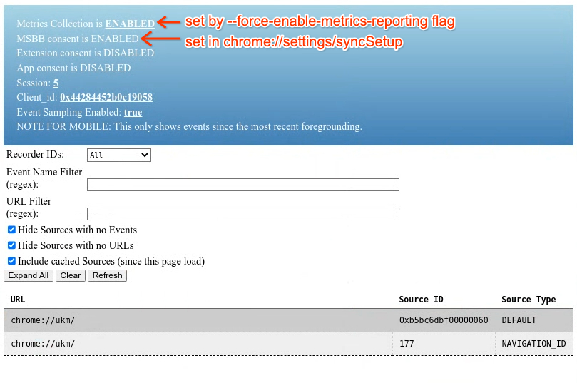

# URL-Keyed Metrics API

This document describes how to write client code to collect UKM data. Before
you add new metrics, you should file a proposal. See [go/ukm](http://go/ukm)
for more information.

Last proofread and updated on 2023/05/18.

[TOC]

## Define Your Metrics in ukm.xml

Any events and metrics you collect need to be defined in
[//tools/metrics/ukm/ukm.xml](https://cs.chromium.org/chromium/src/tools/metrics/ukm/ukm.xml).

### Required Details

* Metric `owner`: the email of someone who can answer questions about how this
  metric is recorded, what it means, and how it should be used. This can include
  multiple people and/or a team alias.
* A `summary` of the event about which you are recording details, including a
  description of when the event will be recorded.
* For each metric in the event: a `summary` of the data and what it means.
* The `enum` type if the metric is enumerated which ensures that every value is
  accounted independently with no attempt to "bucket" the results. The enum uses
  the
  [//tools/metrics/histograms/enums.xml](https://cs.chromium.org/chromium/src/tools/metrics/histograms/enums.xml)
  file for definitions. Note this is the same file for UMA histogram definitions
  so these can ideally be reused.
* If the metric is numeric, then its unit should be stated in the `summary`.
  For example, "seconds", "ms", "KiB". If a bucketing scheme is used, you should
  explain that too so that it's clear to people reading query results.
* If an event will only happen once per Navigation, it can be marked
  `singular="true"` so that the generated proto definition defines the field as
  "optional" instead of "repeated". If multiple such events are attempted, it's
  undefined which one will be kept.

### Example
```xml
<event name="Goat.Teleported">
  <owner>teleporter@chromium.org</owner>
  <owner>teleporter-team@google.com</owner>
  <summary>
    Recorded when a page teleports a goat.
  </summary>
  <metric name="Duration">
    <summary>
      How long it took to teleport in seconds.
    </summary>
  </metric>
  <metric name="GoatType" enum="GoatType">
    <summary>
      The type of goat that was teleported.
    </summary>
  </metric>
</event>
```

### Controlling the Aggregation of Metrics

Control of which metrics are included in the
[History](http://go/aggregated-ukm#history-table) table (the table behind the
main UKM dashboard) is done via the same
[`tools/metrics/ukm/ukm.xml`](https://cs.chromium.org/chromium/src/tools/metrics/ukm/ukm.xml)
file in the Chromium codebase. To have a metric aggregated, `<history>`,
`<aggregation>` and `<statistics>` tags need to be added along with the type of
statistic to be generated.

```xml
<event name="Goat.Teleported">
  <metric name="Duration">
    ...
    <aggregation>
      <history>
        <index fields="profile.country"/>
        <statistics>
          <quantiles type="std-percentiles"/>
        </statistics>
      </history>
    </aggregation>
    ...
  </metric>
</event>
```

Supported statistic types are:

*   `<quantiles type="std-percentiles"/>`: Calculates the "standard percentiles"
    for the values which are 1, 5, 10, 25, 50, 75, 90, 95, and 99%ile.
*   `<enumeration/>`: Calculates the proportions of all values individually. The
    proportions indicate the relative frequency of each bucket and are
    calculated independently for each metric over each aggregation. (Details
    below.)

There can also be one or more `index` tags which define additional aggregation
keys. These are a comma-separated list of keys that is appended to the
[standard set](http://go/aggregated-ukm#history-table). These additional keys
are optional but, if present, are always present together. In other words,
"fields=profile.county,profile.form_factor" will cause all the standard
aggregations plus each with *both* country *and* form_factor but **not** with
all the standard aggregations (see above) plus only one of them. If individual
and combined versions are desired, use multiple index tags.

Currently supported additional index fields are:

*   `profile.country`
*   `profile.form_factor`
*   `profile.system_ram`

### Enumeration Proportions

Proportions are calculated against the number of "page loads" (meaning per
"source" which is usually but not always the same as a browser page load) that
emitted one or more values for the enumeration. The proportions will sum to 1.0
for an enumeration that emits only one result per page-load if it emits anything
at all. An enumeration emitted more than once per source will result in
proportions that total greater than 1.0 but are still relative to the total
number of loads. If an individual value is emitted more than once per source,
that value's proportion will be greater than 1.0.

For example, `Security.SiteEngagement` emits one value (either 4 or 2) per source:

*   Source ID: 1, URL: https://www.google.com/, enum value: 4
*   Source ID: 2, URL: https://www.facebook.com/, enum value: 2
*   Source ID: 3, URL: https://www.wikipedia.com/, enum value: 4
*   Source ID: 4, URL: https://www.google.com/, enum value: 4

A proportion calculated over all sources would sum to 1.0:

*   2 (0.25)
*   4 (0.75)

In contrast, `VirtualKeyboard.Open:TextInputType` emits multiple values per
source, and can emit the same value multiple times per source. The sum of the
proportions for `VirtualKeyboard.Open:TextInputType` will be greater that 1.0,
and some proportions will be greater than 1.0. In the following example,
`TextInputType` is emitted multiple times per source, and `TextInputType=4` is
emitted more than once per source:

*   Source ID: 1, URL:https://www.google.com/, enum values: [1, 2, 4, 6]
*   Source ID: 2, URL:https://www.facebook.com/, enum values: [2, 4, 5, 4]
*   Source ID: 3, URL:https://www.wikipedia.com/, enum values: [1, 2, 4]

A proportion calculated over all sources would be:

*   1 (0.6667 = 2/3)
*   2 (1.0000 = 3/3)
*   3 (absent)
*   4 (1.3333 = 4/3)
*   5 (0.3333 = 1/3)
*   6 (0.3333 = 1/3)

The denominator for each is 3 because there were 3 sources reporting the metric.
The numerator for each enum value is the count of how many times the value was
emitted.

## Client API

### Get UkmRecorder Instance

In order to record UKM events, your code needs a UkmRecorder object, defined by [//services/metrics/public/cpp/ukm_recorder.h](https://cs.chromium.org/chromium/src/services/metrics/public/cpp/ukm_recorder.h)

There are three main ways of getting a UkmRecorder instance.

1) Use `ukm::UkmRecorder::Get()`. This currently only works from the Browser process.

2) Use a service connector and get a UkmRecorder.

```cpp
std::unique_ptr<ukm::UkmRecorder> ukm_recorder =
    ukm::UkmRecorder::Create(context()->connector());
ukm::builders::MyEvent(source_id)
    .SetMyMetric(metric_value)
    .Record(ukm_recorder.get());
```

3) Within blink/renderer, use one of the following methods:

* `blink::Document::UkmRecorder()`
* `blink::ExecutionContext::UkmRecorder()`
* `blink::ResourceFetcher::UkmRecorder()`

4) If you do not have access to any of the methods in 3), establish a remote
connection to a UkmRecorderInterface and use a MojoUkmRecorder to get a
UkmRecorder.

```cpp
mojo::PendingRemote<ukm::mojom::UkmRecorderInterface> recorder;

// This step depends on how the Metrics service is embedded in the application.
BindUkmRecorderSomewhere(recorder.InitWithNewPipeAndPassReceiver());

ukm_recorder = std::make_unique<ukm::MojoUkmRecorder>(std::move(recorder));
ukm::builders::MyEvent(source_id)
    .SetMyMetric(metric_value)
    .Record(ukm_recorder.get());
```
Depending on which directory you are getting the UkmRecorder from, you need the
correct interface binder to replace the `BindUkmRecorderSomewhere()` part above.
Some options are:

* blink/renderer: `Platform::Current()->GetBrowserInterfaceBroker()->GetInterface()`
* content/renderer: `content::RenderThread::Get()->BindHostReceiver()`

Note: Establishing a new remote connection each time (i.e. per frame, etc.) has
overhead, so try to avoid opening a new one each time.


### Get a ukm::SourceId

UKM identifies navigations by their source ID and you'll need to associate an ID with your event in order to tie it to a main frame URL. Preferably, get an existing ID for the navigation from another object.

Prefer using `ukm::SourceId` if only the underlying int64 value is required to identify a source and is used in Mojo interface, and no type conversion needs to be performed. If additional source type information is needed, `ukm::SourceIdObj` can be used.

The main method for getting an existing ID is by converting from the navigation ID:

```cpp
ukm::SourceId source_id = render_frame_host->GetPageUkmSourceId();
ukm::SourceId source_id = ukm::ConvertToSourceId(
    navigation_handle->GetNavigationId(), ukm::SourceIdType::NAVIGATION_ID);
```

Some events however occur in the background, and a navigation ID does not exist. In that case, you can use the `ukm::UkmBackgroundRecorderService` to check whether the event can be recorded. This is achieved by using the History Service to determine whether the event's origin is still present in the user profile.

```cpp
// Add the service as a dependency in your service's constructor.
DependsOn(ukm::UkmBackgroundRecorderFactory::GetInstance());

// Get an instance of the UKM service using a Profile.
auto* ukm_background_service = ukm::UkmBackgroundRecorderFactory::GetForProfile(profile);

// Check if recording a background event for |origin| is allowed.
ukm_background_service->GetBackgroundSourceIdIfAllowed(origin, base::BindOnce(&DidGetBackgroundSourceId));

// A callback will run with an optional source ID.
void DidGetBackgroundSourceId(absl::optional<ukm::SourceId> source_id) {
  if (!source_id) return;  // Can't record as it wasn't found in the history.

  // Use the newly generated source ID.
  ukm::builders::MyEvent(*source_id)
      .SetMyMetric(metric_value)
      .Record(ukm_recorder.get());
}
```

For the remaining cases you may need to temporarily create your own IDs and associate the URL with them. However we currently prefer that this method is not used, and if you need to setup the URL yourself, please email the OWNERS of components/ukm.
Example:

```cpp
ukm::SourceId source_id = ukm::UkmRecorder::GetNewSourceID();
ukm_recorder->UpdateSourceURL(source_id, main_frame_url);
```

You will also need to add your class as a friend of UkmRecorder in order to use this private API.

### Create Events

Helper objects for recording your event are generated from the descriptions in ukm.xml. You can use them like so:

```cpp
#include "services/metrics/public/cpp/ukm_builders.h"

void OnGoatTeleported() {
  ...
  ukm::builders::Goat_Teleported(source_id)
      .SetDuration(duration.InSeconds())
      .SetGoatType(goat_type)
      .Record(ukm_recorder);
}
```

If the event name in the XML contains a period (`.`), it is replaced with an underscore (`_`) in the method name.

To avoid having UKM report becoming unbounded in size, an upper limit is placed on the number of events recorded for each event type. Events that are recorded too frequently may be subject to downsampling on the Stable and Beta channels (see [go/ukm-downsampling](http://go/ukm-downsampling)). As a rule of thumb, it is recommended that most events be recorded at most once per 100 page loads on average to limit data volume. In addition, if an event type is observed to be spammy, is heavily downsampled, or to account for more than 10% of all recorded UKM events combined on any platform, you will be asked to reduce the event emission frequency.

For data quality purposes, if you have the option to record an event from either the browser process or a renderer process, prefer the former. Because renderer processes are not trusted, events recorded in them are more complex to attribute to the corresponding browser-side navigations using the `DocumentCreated` event (see [go/ukm-readable-guide](http://go/ukm-readable-guide#processing-events-attached-to-blink-document-sources)). Joining using the `DocumentCreated` method also has limitations, such as partial availability of the event due to downsampling, and query performance impacted by the additional join operation.

### Singular UKM Events

The Singular UKM Entry provides a type safe API for updating metric fields of an event where only the latest metric values are recorded. The Singular UKM Entry must be used and destroyed on the same sequence it was created. Currently, only recording from the browser process is supported.

Example:

```cpp
#include "components/ukm/singular_ukm_entry.h"
#include "services/metrics/public/cpp/ukm_builders.h"

// Create the SingularUkmEntry for an event.
std::unique_ptr<SingularUkmEntry<ukm::builders::MyEvent>> entry =
  SingularUkmEntry<ukm::builders::MyEvent>::Create(source_id);

{
  // Create a builder for the entry to set the metrics.
  SingularUkmEntry<ukm::builders::MyEvent>::EntryBuilder builder = entry->Builder();
  builder->SetMyMetric(metric_value);
  // When `builder` goes out of scope, the constructed entry will be saved with the SingularUkmEntry.
}

{
  SingularUkmEntry<ukm::builders::MyEvent>::EntryBuilder builder = entry->Builder();
  builder->SetMyMetric(metric_value2);
}
```

The arrow operator (`->`) on a builder is used to set the desired metrics of an event. Once the `builder` is destroyed the newly constructed event is saved as the latest event. The last event, with metric `metric_value2`, is recorded by the UkmRecorder when `entry` is destroyed.

Additional documentation can be found [here](https://cs.chromium.org/chromium/src/components/ukm/singular_ukm_entry.h).

## Local Testing

Build Chromium and run it with flags `--force-enable-metrics-reporting --metrics-upload-interval=N`. The first flag overrides metrics collection to be ON. The second flag means that locally collected metrics will be populated in a UKM report and uploaded every `N` seconds; You may want some small `N` if you are interested in seeing this behavior.

Then in the browser, go to `chrome://settings/syncSetup` and toggle "Make searches and browsing better" to be ON. If you're unabled to do this, you can pass the command line flag `--force-msbb-setting-on-for-ukm` instead.

You should now be seeing "Metrics Collection is ENABLED. MSBB consent is ENABLED" at the top of the `chrome://ukm` debugging page:



If you want to test Extension- or App-related UKMs, toggle the corresponding sync consent in `chrome://settings/syncSetup/advanced`.

Trigger your event locally, refresh `chrome://ukm`, then double-check that your events are recorded correctly.

### Enable Console Debugging Messages

If you're encountering issues concerning UKM user consent, recording events, or uploading UKM reports, you can enable console debugging logs by passing the command line flag `--vmodule=*components/ukm*=n` where `n` is the logging level number between 1 and 3, with the convention:

1: Infrequent actions such as changes to user consent, or actions that typically occur once per reporting cycle, e.g. serialization of locally recorded event data into one report and uploading the report to the UKM server.\
2: Frequent and recurrent actions within each reporting period, such as an event being recorded, or a new browser navigation has occurred.\
3: Very frequent and possibly spammy actions or checks, such as events being dropped due to disabled recording.

Setting a level `n` enables logging messages at all levels <= `n`.

In case of doubt, or if you need a starting point to debug why `chrome://ukm` isn't showing any data in a local build, you can start with:
```bash
./out/Default/chrome --force-enable-metrics-reporting --metrics-upload-interval=300 --vmodule=*components/ukm*=3
```


## Unit Testing

You can pass your code a `TestUkmRecorder` (see [//components/ukm/test_ukm_recorder.h](https://cs.chromium.org/chromium/src/components/ukm/test_ukm_recorder.h)) and then use the methods it provides to test that your data records correctly.

## Adding UKMs Every Report

Certain information may be useful to be included on every uploaded UKM report. This may be applicable if your information is always "available" in some sense, as opposed to triggered/computed at a particular instance, which is the default. In this case, the best way to proceed is to setup a [MetricsProvider](https://source.chromium.org/chromium/src/components/metrics/metrics_provider.h). The new Provider should implement the `ProvideCurrentSessionUKMData()` method. Record a UKM Event within that implementation, and it will be recorded exactly once per UKM report, immediately before the information is uploaded.

## Recording Information about Subframes URLs via Categorization

The UKM infrastructure primarily supports recording metrics tied with navigation URLs as that is the basis of the consent model. As there is desire for information related to URLs loaded within a page itself (i.e. subframe URLs), here we describe an approach for how to record this via categorization.

We are able to emit information related to subframe URLs within an UKM event as long as we don't capture the exact URL, but instead emit some categorical label, such as 'ad', or 'uses WebFramework1'. It may be possible for specific sites to be added as a category but this requires privacy review. In general, we prefer to avoid being specific about a site and suggest more general categorization instead.

The full metrics will not be keyed off the subframe URL. Rather, the subframe URL data will be tied with the main frame URL, and it will be emitted as a custom metric. It is possible to emit these events multiple times if there are several subframe URLs with the properties we want to observe on the same page.

### Example


```xml
<event name="WebFrameworkPerformance">
  <owner>owner@chromium.org</owner>
  <summary>
    Recorded when a page uses on of a list of known web frameworks. This records various performance measurements.
  </summary>
  <metric name="WebFramework" enum="WebFrameworkName">
    <summary>
      Web Framework used.
    </summary>
  </metric>
  <metric name="FrameworkLoadInMs">
    <summary>
      Time to load the framework in milliseconds.
    </summary>
  </metric>
</event>
```

And in the UKM enum.xml:

```xml
<enum name="WebFrameworkName">
  <int value="0" label="Unknown"/>
  <int value="1" label="WebFramework1"/>
  <int value="1" label="WebFramework2"/>
  ...
</enum>
```

In this example, if a known framework was loaded with a time of 150ms, we could record the framework name and the load time, tied together with the main frame URL. Note that there will need to be custom logic to map the provider to the enum. It’s possible this logic may be reusable across UKM clients, please verify if some similar recording is being done elsewhere.
